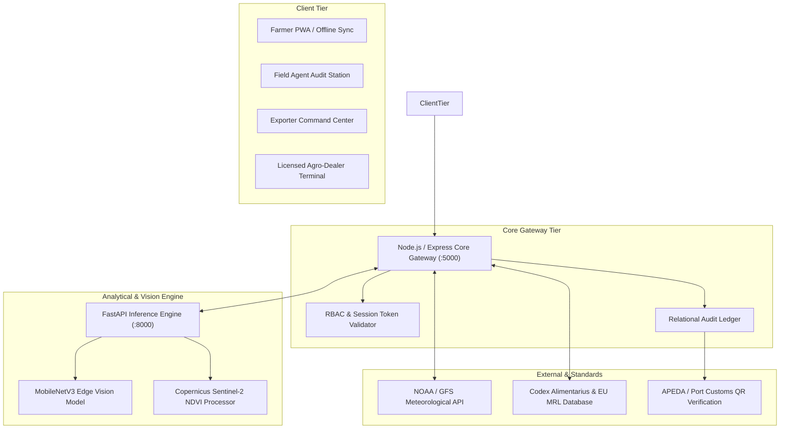

# Technical Approach & Architectural Specification: AgriSmart Platform (SIH26193)

---

## 1. Executive Technical Summary & System Philosophy

**AgriSmart** is an enterprise-grade, distributed agricultural intelligence and supply chain traceability platform engineered for the Smart India Hackathon (SIH26193). The system resolves the systemic lack of transparency, data fragmentation, and export non-compliance (Codex Alimentarius, APEDA, EU MRL) that disproportionately affects smallholder farmers and agro-exporters.

The architecture adopts an **asymmetric multi-tier design**:
1. **High-Throughput Node.js/Express Core API Engine (`:5000`)**: Manages state transitions, relational ledgers, tokenized input procurement, and role-based access control (RBAC).
2. **Python/FastAPI Microservice Engine (`:8000`)**: Executes tensor-based computer vision, phenotypic anomaly matching, and multi-spectral vegetative index calculations.
3. **Dual-Client Frontend Runtime (`:3000`)**: Combines a modern React 18 / Tailwind CSS Progressive Web App (PWA) with offline-first IndexedDB caching and bilingual (English/Tamil) localization.

---

## 2. Distributed Architecture & Component Interactions

### 2.1 Core API Gateway (`Node.js/Express`)
* **Role-Based Access Control (RBAC)**: Enforces strict data isolation across four primary personas:
  * **Farmer**: Parcel registration, crop cycle tracking, agrochemical purchase requests, and dynamic task scheduling.
  * **Field Agent**: GPS-geofenced inspections, photographic disease verification, and APEDA compliance auditing.
  * **Agro-Dealer / Shop**: Cryptographic token redemption (`#TKN`), QR-scanned input disbursement, and batch traceability.
  * **Exporter**: Contracted land telemetry, inline accordion traceability logs, residue audit scoring, and container passport generation.
* **Resilient Dual-Runtime**: Operates identically whether run as a compiled Vite React single-page app or via low-overhead standalone static asset delivery.

### 2.2 Analytical Microservice Engine (`Python/FastAPI`)
* **High-Concurrency Asynchronous Endpoints**: Employs ASGI async pipelines for compute-intensive tasks without blocking transactional API flows.
* **Spectral Analysis Pipeline**: Ingests Sentinel-2 multispectral band data (Band 4 Red and Band 8 Near-Infrared) to compute vegetative vigor indices:
  $$\text{NDVI} = \frac{\text{NIR} - \text{Red}}{\text{NIR} + \text{Red}}$$
* **Computer Vision Inference**: Leverages lightweight MobileNetV3 architectures optimized for sub-150ms inference on foliar pathology samples.

---

## 3. Remote Sensing & Predictive Meteorological Engine

### 3.1 Satellite Vegetative Indexing
* **Copernicus Sentinel-2 MSI Ingestion**: Tracks 10m-resolution surface reflectance data across farmer-registered geospatial polygons.
* **Zone Stress Detection**: Flags localized chlorophyll degradation ($NDVI < 0.45$), triggering preemptive field inspection alerts before physical symptom emergence.

### 3.2 Meteorological Dynamic Rescheduling
* **Weather Service Integration**: Polls NOAA/GFS meteorological telemetry for precipitation probability, wind velocity, and relative humidity.
* **Rain-Triggered Spray Delays**: If rainfall $>5\text{mm}$ is forecasted within 48 hours of a scheduled chemical application:
  * The system shifts the planned task forward by $+2$ days to prevent chemical wash-off.
  * Updates the dynamic harvest window accordingly to preserve pre-harvest intervals (PHI).

---

## 4. Edge AI & Field Inspection Verification Protocol

### 4.1 Anti-Spoofing Geofence Validation
* **Hardware-Locked Geolocation**: Field agents must physically execute inspections within parcel boundaries.
* **Haversine Distance Enforcement**:
  $$d = 2R \arcsin\left(\sqrt{\sin^2\left(\frac{\Delta \phi}{2}\right) + \cos(\phi_1)\cos(\phi_2)\sin^2\left(\frac{\Delta \lambda}{2}\right)}\right)$$
  Enforces a strict $<50\text{m}$ validation radius against parcel centroids, rejecting spoofed GPS coordinates.

### 4.2 Streamlined AI Decision Badges
* **MobileNetV3 Edge Diagnosis**: Evaluates foliar leaf images across three criteria:
  1. Pest Infestation Risk (Low / Moderate / High)
  2. Nutrient Deficiency (Nitrogen / Phosphorus / Potassium)
  3. Physical Plant Health (Vigor Score %)
* **Bayesian Auto-Suggestions**: Displays automated agent suggestion badges (`Auto: Pass`, `Low Residue Risk`) with one-click approval to expedite high-throughput field audits while maintaining human-in-the-loop accountability.

---

## 5. Closed-Loop Agrochemical Traceability & MRL Engine

### 5.1 Tokenized Input Chain (`#TKN`)
* **Counterfeit Prevention**: When a farmer creates a chemical application task, the system issues a unique, time-stamped authorization token (e.g., `#TKN-7821`).
* **Authorized Dealer Disbursement**: Input procurement is exclusively redeemable at authorized agricultural input shops. Unregistered chemical applications are flagged as non-compliant.

### 5.2 Kinetic Pesticide Residue Decay Modeling
* **First-Order Decay Equation**:
  $$C(t) = C_0 \cdot e^{-k \cdot \Delta t}$$
  Where:
  * $C(t)$ = Current chemical residue concentration in parts per million (ppm).
  * $C_0$ = Initial application concentration.
  * $k$ = Environmental half-life decay constant ($\text{days}^{-1}$).
  * $\Delta t$ = Elapsed time since application.
* **Real-Time Regulatory Threshold Benchmarking**: Continuously compares $C(t)$ against Codex Alimentarius and European Union Maximum Residue Limits (EU MRL).
* **PHI Harvest Gatekeeper**: Blocks final harvest clearance until $C(t) < \text{MRL}_{\text{threshold}}$, eliminating consignments rejection risk at overseas ports.

---

## 6. Cryptographic Export Trust & Port Verification

### 6.1 Immutable Batch Passport
* **SHA-256 Cryptographic Hash**: Combines parcel boundary polygon, chemical log chain, agent digital signatures, and laboratory residue scores into a tamper-evident digital ledger block.
* **Level-H High-Density QR Codes**: Generated per export container lot. Scanning by customs or import authorities displays complete farm-to-dock provenance in real-time.

---

## 7. SIH PowerPoint Presentation Ready Deck (Bullet Format)

### Slide 1: Technical Architecture & Intelligence Pipeline
* **Distributed Multi-Tier Stack**: Node.js/Express REST API Gateway (`:5000`) for transactional RBAC and audit ledgers + Python/FastAPI (`:8000`) for tensor vision & spectral processing.
* **Offline-First React 18 PWA**: Dual-runtime architecture with **IndexedDB local sync** and **bilingual engine (English/Tamil)** for low-bandwidth rural operations.
* **Copernicus Sentinel-2 Satellite Pipeline**: 10m-resolution **NDVI calculation ($\frac{\text{NIR} - \text{Red}}{\text{NIR} + \text{Red}}$)** for remote crop health monitoring and early pest stress detection.
* **Meteorological Dynamic Shift**: Real-time integration with **NOAA / GFS weather forecasts** automatically shifts pesticide & harvest tasks by **+2 days** upon precipitation risk.

### Slide 2: Verification, MRL Compliance & Export Clearance
* **Anti-Spoofing Edge Inspection**: **Haversine GPS boundary validation (<50m radius)** paired with **MobileNetV3 deep learning (<150ms)** for real-time foliar pest & disease diagnosis.
* **Tokenized Input Chain (`#TKN`)**: Cryptographic handshakes between farmers and licensed agro-dealers eliminate counterfeit and unapproved pesticide usage.
* **First-Order Kinetic MRL Decay Engine ($C_t = C_0 e^{-kt}$)**: Real-time residue dissipation tracking benchmarked against **EU MRL & Codex Alimentarius standards** with automated Pre-Harvest Interval (PHI) locks.
* **Cryptographic Export Certification**: **SHA-256 hashed ledger** and tamper-evident **Level-H QR codes** providing instant digital batch clearance to **APEDA, port customs, and international buyers**.

---
*AgriSmart — Smart India Hackathon (SIH26193)*
